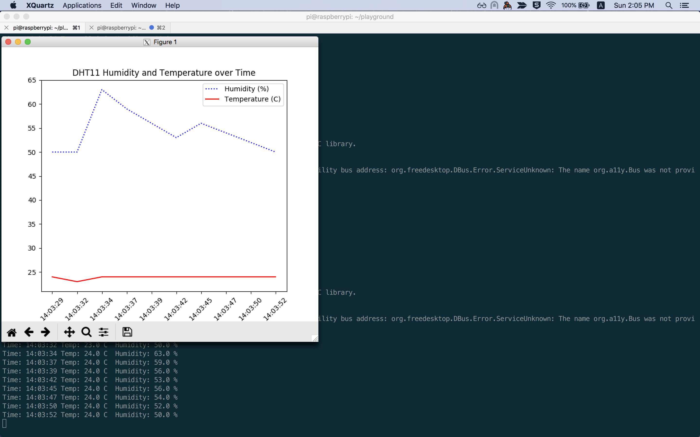

# Plotting sensor data with *matplotlib*

How about producing some informative plots with your instant readings, such as 



You could run code such as [plot_temperature_and_humidity.py](plot_temperature_and_humidity.py) on your Raspberry Pi.
If you're connecting via ssh, however, make sure to connect with X-forwarding enabled, like so:
```bash 
ssh -Y pi@192.168.0.10
```

This might not work on Windows. 
The Raspberry Pi Foundation docs on ssh note that [X11 is no longer present on Macs with OSX](https://www.raspberrypi.org/documentation/remote-access/ssh/unix.md).
So, to ensure that it works on Mac OS, you have to [download](https://www.xquartz.org/) and install *xquartz*.